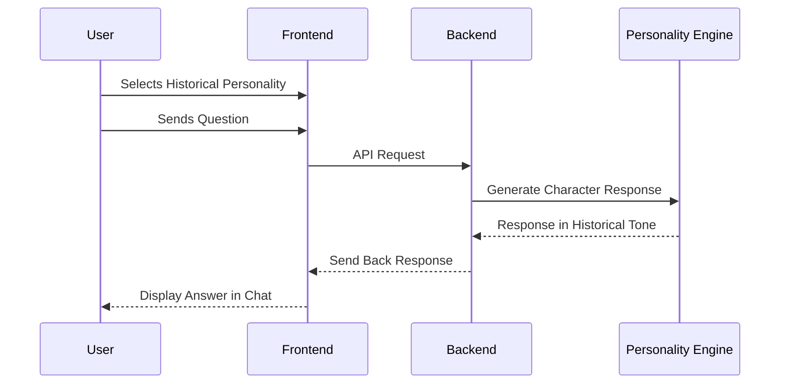

# 🏛️ Historical Chatboard Project  

---

## ✨ *Project Overview*  
**Historical Chatboard** is an **interactive web application** that lets users have conversations with legendary Indian historical personalities — reimagined through modern technology and **AI-driven character simulation.**  

Developed by students of **Government Polytechnic, Awasari Khurd, Pune (NBA Accredited)**, this project blends **technical innovation** with **cultural heritage** to foster both **deep learning** and **skill development.**  

---

## 🎯 *Purpose & Motivation*  

> Inspired by the **World Skills Competition 2026** — a global platform for vocational and technical talent.  

- **Interactive Learning:** Chat with figures like *Shivaji Maharaj* or *Mahatma Gandhi*.  
- **Skill Building:** Apply modern web dev tools (React, TypeScript, Tailwind).  
- **Cultural Preservation:** Digitally celebrate **Indian heritage and values.**  
- **Global Readiness:** Train diploma students to shine on the world stage.  

---

## 🚀 *Technologies Used*  

| **Technology**   | **Role in Project** |
|------------------|----------------------|
| **Vite**         | Fast frontend build tool |
| **TypeScript**   | Type-safe, maintainable code |
| **React**        | Component-based UI framework |
| **Tailwind CSS** | Utility-first responsive styling |
| **shadcn/ui**    | Pre-built accessible React components |

---

## 🛠️ *Setup Instructions*  

<details>
<summary>🔧 Click to Expand Installation Guide</summary>

### Prerequisites  
- Install **Node.js** (LTS version recommended, via [nvm](https://github.com/nvm-sh/nvm))  
- Install **npm** (comes with Node.js)  

### Steps  
1. **Clone the repository**  
   ```bash
   git clone <YOUR_GIT_URL>
   ```

2. **Navigate to project folder**
   ```bash
   cd <YOUR_PROJECT_NAME>
   ```

3. **Install dependencies**
   ```bash
   npm install
   ```

4. **Run development server**
   ```bash
   npm run dev
   ```

</details>  

---

## 🌐 *Deployment*

- Deploy via **Vercel**, **Netlify**, or **Render**.
- Supports **custom domains** for branding.
- Ready for **CI/CD pipelines** and scalable rollout.

---

## 🖼️ *System Architecture*

```mermaid
flowchart TD
    U[👩‍💻 User] -->|Chooses Personality & Asks Question| FE[🌐 Frontend (React + Vite)]
    FE -->|API Call| BE[(⚙️ Backend - Node/Express/Django)]
    BE --> DB[(🗄️ Knowledge Base / Historical Dataset)]
    BE --> LLM[🧠 Personality Engine (AI Model)]
    LLM -->|Generates Response| FE
    DB --> BE
    FE --> U
```

### Components

- **Frontend (React + Vite):** Chat UI & interactions
- **Backend (Node/Express/Django):** Routes requests, handles logic
- **AI Engine:** Powers **personality simulation**
- **Knowledge Base:** Stores speeches, philosophies, and history

---

## 📲 *Feature Flow*



---

## 🏆 *Institutional Recognition*

This project supports **NBA accreditation** standards and represents:

- Excellence in **vocational training**
- Participation in **World Skills Competition 2026**
- Real-world experience for **diploma students**

---

## 📬 *Contact & Support*

**Yash Magar** 
**Email:** yashajaymagar10@gmail.com


---

## 📢 *Notice & Opportunity*

All diploma students are **invited to contribute** and use this project as a **pathway to global recognition.**  

👉 Register for the **World Skills Competition**: [skillindiadigital.gov.in](https://www.skillindiadigital.gov.in)  

---

> *“Let history meet technology. Build your skills, expand your horizons, and represent India on the global stage!”*
